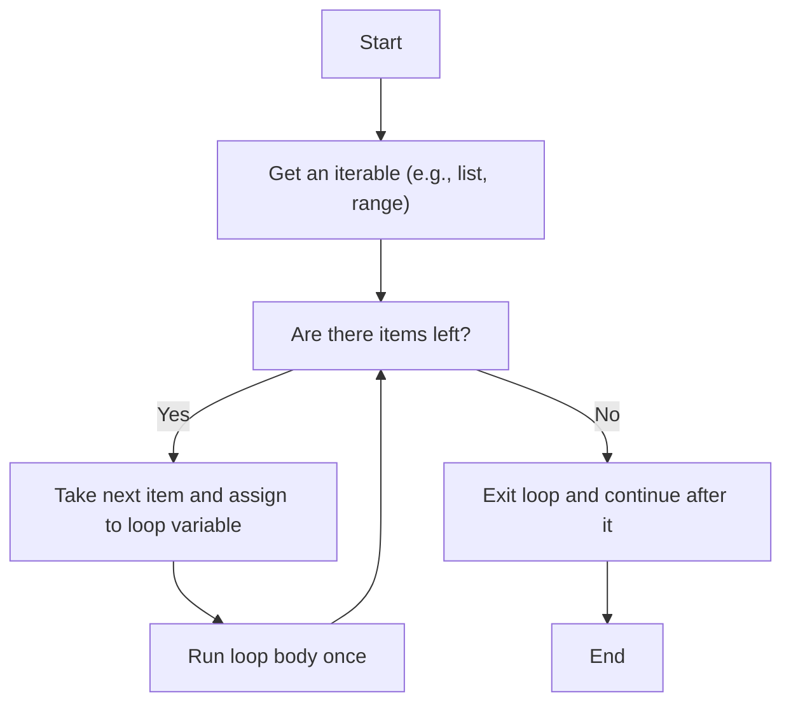
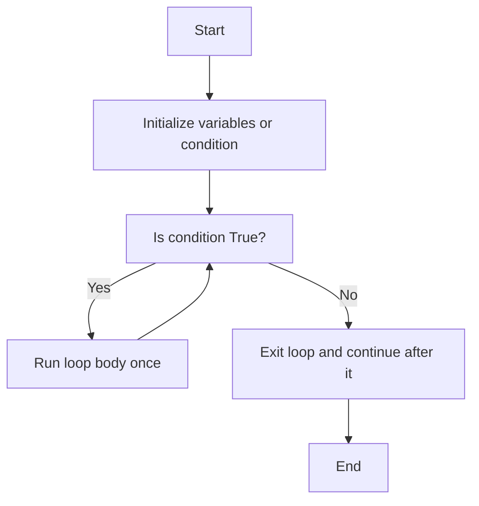

### for loops

```mermaid

flowchart TD
  A["Start"] --> B["Get an iterable (e.g., list, range)"]
  B --> C["Are there items left?"]
  C -- "Yes" --> D["Take next item and assign to loop variable"]
  D --> E["Run loop body once"]
  E --> C
  C -- "No" --> F["Exit loop and continue after it"]
  F --> G["End"]
  
```

 

 

 

 

 

### While loops

```mermaid

flowchart TD
  A["Start"] --> B["Initialize variables or condition"]
  B --> C["Is condition True?"]
  C -- "Yes" --> D["Run loop body once"]
  D --> C
  C -- "No" --> F["Exit loop and continue after it"]
  F --> G["End"]

```

